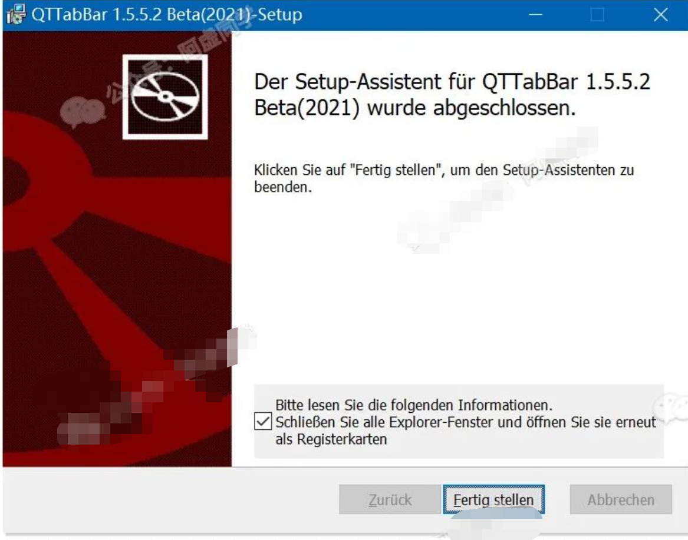
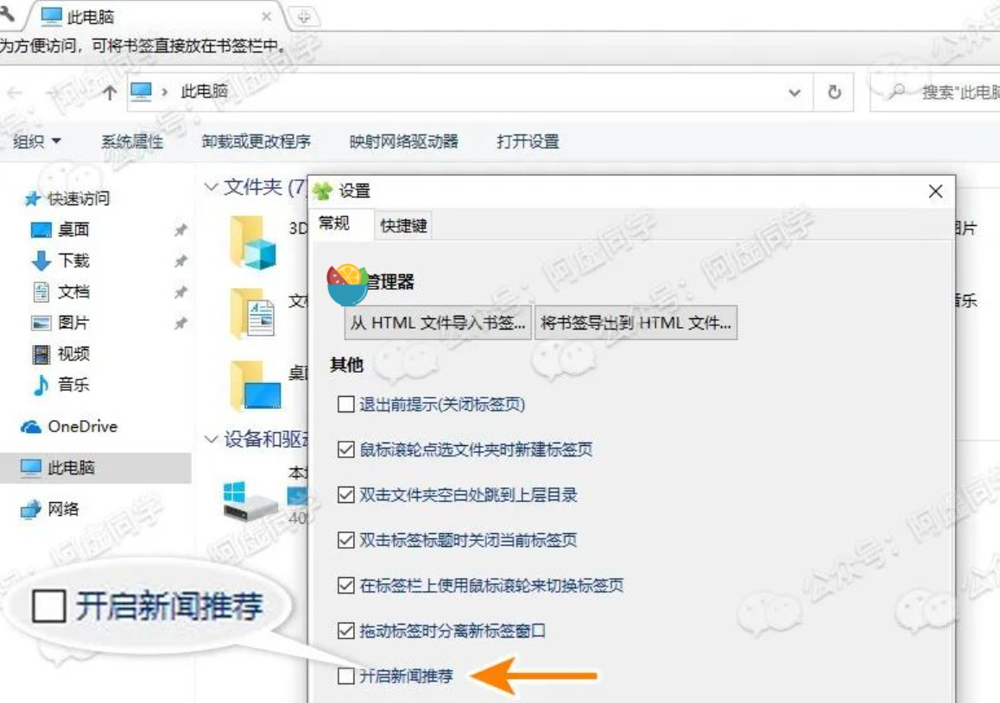

# QTTabBar

## 1.URL
Github URL：https://indiff.github.io/qttabbar/

Gitee URL：https://gitee.com/qwop/qttabbar

## 2.How to install
Just click "Weiter". 

At the end of the installation interface, click the default check box, and then click "Fertig stellen" in the middle to complete the installation

# Clover

## 1.URL
http://cn.ejie.me/

## 2.How to use
forbid commercial inserts
